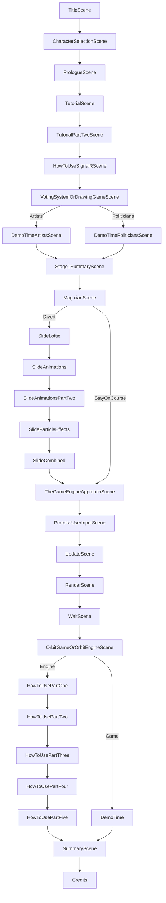


# Title

Welcome the audience, thank you all for joining me today. You know NDC has a special place in my heart - I spoke here last year which was my first ever in-person talk at a conference. Todays talk is related to that talk but we are branching out with the content. Join me as we embark upon an adventure to learn about building games in .NET MAUI.

# Character selection

While this slightly contradicts the premise of a choose your own adventure book I needed to somehow slip in who I am. Given that the underlying theme of this talk is around building games I thought that a character selection screen made sense.

So who am I?

My name is Shaun Lawrence
I am a software engineer/consultant and have been working with .NET based technologies since my career began roughly 17 years ago.
I am honoured to have been awarded with the Microsoft MVP award for the past 2 years.
I was also 'lucky' enough to be given the opportunity to write a book. My publishing keeps telling me off for not talking about it enough so it is titled 'Introducing .NET MAUI' and is available at all good online book retailers.
In fact I have a copy with me today which I plan to give away at random. More on this shortly...

I guess part of the main reason I am here talking to you all today is because I have learned to fully embrace what I have labelled as weaknesses here.
I do get distracted easily and much like Magpie I like to chase after the next shiny thing.
I am also great at following that shiny thing down a deep deep rabbit hole, get lost or stuck down there and then end up eating some cake to cheer me up.
In fact I now wonder whether I have somehow been rewarding this behaviour... Cake Driven Development

# Prologue

So that is enough about me, let's take a brief look at what we will be covering today and how...

I have been very passionate about gaming ever since saving up to buy my first ever console back in 1992 - the NES. That in combination of a plentiful supply of second hand choose your own adventure books from my nan has helped get me here today.

There are some things that I would like to introduce you all to before we get going on the content.

The first is that all of the content you see today is either baked into a .NET MAUI based game or code within Visual Studio, because I decided to go this route I really struggled to prevent myself from getting carried away with functionality in the hope that the system presenting the content also makes up part of the content itself.

Another point, and while this have been a nice selling point on my talk submission is has proven to be somewhat of a challenge... you will be influencing the content that gets shown today. Through the magic of SignalR you will be able to navigate to a blazor based web page and when each decision point is reached, provide your vote. I should add that I owe a big thanks to a good friend Gerald for having already built some of the SignalR voting system. Thanks to the wonders of open-source I was able to fork it and bend it to suit my needs. One decision point will actually allow you to choose to understand the voting system itself.

And finally, I mentioned before that I would be giving a copy of my book away today. If all goes well and I will be honest this part scares me a little as I saw some inconsistencies in leading up to this part
after voting on the last decision point one lucky voter will be shown a congratulations message. The message does say to come down and collect your prize, it might be best to take a screenshot and then come down
at the end of the talk.

# World map part 0

Welcome to our world for the next check watch minutes. I mentioned before that we will be making use of SignalR and your very own opinions to decide how we navigate our way through this world through to our destination down here, the office. The very first part of our journey is to get to know our environment and how to play the game.

# Tutorial - What is .NET MAUI?

As with all good games this talk wouldn't be complete without first introducing you all to your environment and how it effects us. There are 2 key components affecting us today and the is .NET MAUI.

- Multi-platform App UI

- Cross-platform framework

  - Mobile - Android and iOS

  - Desktop - macOS and Windows

  - Smart Samsung things - Tizen

- Evolution of Xamarin.Forms

  - First class features such as AppBuilder, etc.

- Build with the platform

# Tutorial - What is SignalR?

The second key component is SignalR.

- Open-source

- ASP.NET Core

- Real-time communication

- Bi-directional connection

- Scalable

- Manages complexity for us
    - Fallback via
    - WebSockets
    - Event Source (Server-sent events)
    - Forever Frame (hidden iFrame)
    - Long Polling

- Supports many platforms - JS, C#, F#, VB, Java

# World map part 1

That's our tutorial completed. Now moving onto our first decision. I don't know about you all but I struggle so much with decision making in games and well in general. I find with gaming I always want to cover all outcomes. Anyway today I don't have to make the decisions it's all up to you.

# Decision Time 1

We could make this fit, have the tutorial screen presented by the elders and then set us off on a quest.

# Gaming

## What are we building?

Diagram of the whole system.

## Server side implementation

Two components on the server side;

### Creating a Hub

```csharp
using AirHockey.Server;
using AirHockey.Shared;
using Microsoft.AspNetCore.SignalR;

namespace AirHockey.Server.Hubs;

public class GameHub : Hub
{
    public GameHub(ILogger<GameWorker> logger, GameManager gameManager)
    {
        this.logger = logger;
        this.gameManager = gameManager;
    }

    private readonly ILogger<GameWorker> logger;
    private readonly GameManager gameManager;

    public async Task PlayGame(Guid playerId)
    {
        var game = this.gameManager.PlayGame(playerId);

        var connectedPlayer = game.PlayerOne.Id == playerId ? game.PlayerOne : game.PlayerTwo;

        this.logger.LogInformation("Player connected {id}", playerId);

        await Clients.All.SendAsync(EventNames.PlayerConnected, connectedPlayer);

        if (game.PlayerTwo != PlayerState.Empty)
        {
            await Clients.All.SendAsync(EventNames.GameStarted, new GameState(game.Id, game.PlayerOne, game.PlayerTwo));
        }
    }

    public async Task UpdatePlayerState(PlayerState playerState)
    {
        var game = this.gameManager.Games.FirstOrDefault(g => g.PlayerOne.Id == playerState.Id || g.PlayerTwo.Id == playerState.Id);

        if (game is not null)
        {
            this.logger.LogInformation("Update player {id}", playerState.Id);

            if (game.PlayerOne.Id == playerState.Id)
            {
                game.PlayerOne = playerState;
            }
            else
            {
                game.PlayerTwo = playerState;
            }

            await Clients.Others.SendAsync(EventNames.PlayerStateUpdated, playerState);
        }
    }
}
```

Cover difference between typed/untyped hubs.

### Registering the Hub

```csharp
using AirHockey.Server;
using AirHockey.Server.Hubs;

var builder = WebApplication.CreateBuilder(args);

// Register SignalR dependencies.
builder.Services.AddSignalR();

var app = builder.Build();

app.UseHttpsRedirection();

// Map our hub implementation to /Game from the main url.
app.MapHub<GameHub>("Game");

app.Run();
```

### Creating a BackgroundService

```csharp
public class GameWorker : BackgroundService
{
    private readonly ILogger<GameWorker> logger;
    private readonly GameManager gameManager;
    private readonly IHubContext<GameHub> hubContext;

    public GameWorker(ILogger<GameWorker> logger, GameManager gameManager, IHubContext<GameHub> hubContext)
    {
        this.logger = logger;
        this.gameManager = gameManager;
        this.hubContext = hubContext;
    }

    protected override async Task ExecuteAsync(CancellationToken stoppingToken)
    {
        while (!stoppingToken.IsCancellationRequested)
        {
            int delayInMilliseconds = 5;

            var game = this.gameManager.Games.FirstOrDefault();

            if (game is not null)
            {
                await ProcessGame(game);
            }

            await Task.Delay(delayInMilliseconds, stoppingToken);
        }
    }
}
```

### Registering the BackgroundService

```csharp
using AirHockey.Server;
using AirHockey.Server.Hubs;

var builder = WebApplication.CreateBuilder(args);

// Register the background service
builder.Services.AddHostedService<GameWorker>();

var app = builder.Build();

app.UseHttpsRedirection();

app.Run();
```

## Client side implementation

```csharp
public PlayerStateManager()
	{
        hubConnection = new HubConnectionBuilder()
            .WithUrl("https://localhost:7226/Game")
            .Build();

        PuckState = new();
        ScoreState = new();
        PlayerState = new(Guid.NewGuid());

        hubConnection.On<PuckState>(EventNames.PuckStateUpdated, puckState =>
        {
            PuckState = puckState;
        });
        hubConnection.On<ScoreState>(EventNames.ScoreUpdated, scoreState =>
        {
            ScoreState = scoreState;
        });

        hubConnection.On<PlayerState>(EventNames.PlayerStateUpdated, playerState =>
        {
            OpponentState = playerState;
        });

        hubConnection.On<PlayerState>(EventNames.PlayerConnected, playerState =>
        {
            if (PlayerState.Id == playerState.Id)
            {
                PlayerState = playerState;
            }
            else
            {
                OpponentState = playerState;
            }
        });

        hubConnection.On<GameState>(EventNames.GameStarted, gameState =>
        {
            if (PlayerState.Id == gameState.PlayerOne.Id)
            {
                PlayerState = gameState.PlayerOne;
                OpponentState = gameState.PlayerTwo;
            }
            else
            {
                PlayerState = gameState.PlayerTwo;
                OpponentState = gameState.PlayerOne;
            }
        });
    }

public async Task Connect()
    {
        await hubConnection.StartAsync();

        await hubConnection.SendAsync(MethodNames.PlayGame, PlayerState.Id);
    }

    public Task Disconnect()
    {
        return hubConnection.StopAsync();
    }

    public async Task UpdateState(float x, float y)
    {
        PlayerState.X = x;
        PlayerState.Y = y;
        await hubConnection.SendAsync(MethodNames.UpdatePlayerState, PlayerState);
    }
```

## Demo Time

Show the air hockey app.

# Alternative hosting options

PlayFab, etc.

# Democracy

## What are we building?

Diagram of the whole system.

## Server side implementation

Two components on the server side;

### Creating a Hub

```csharp
using AirHockey.Server;
using AirHockey.Shared;
using Microsoft.AspNetCore.SignalR;

namespace AirHockey.Server.Hubs;

public class GameHub : Hub
{
    public GameHub(ILogger<GameWorker> logger, GameManager gameManager)
    {
        this.logger = logger;
        this.gameManager = gameManager;
    }

    private readonly ILogger<GameWorker> logger;
    private readonly GameManager gameManager;

    public async Task PlayGame(Guid playerId)
    {
        var game = this.gameManager.PlayGame(playerId);

        var connectedPlayer = game.PlayerOne.Id == playerId ? game.PlayerOne : game.PlayerTwo;

        this.logger.LogInformation("Player connected {id}", playerId);

        await Clients.All.SendAsync(EventNames.PlayerConnected, connectedPlayer);

        if (game.PlayerTwo != PlayerState.Empty)
        {
            await Clients.All.SendAsync(EventNames.GameStarted, new GameState(game.Id, game.PlayerOne, game.PlayerTwo));
        }
    }

    public async Task UpdatePlayerState(PlayerState playerState)
    {
        var game = this.gameManager.Games.FirstOrDefault(g => g.PlayerOne.Id == playerState.Id || g.PlayerTwo.Id == playerState.Id);

        if (game is not null)
        {
            this.logger.LogInformation("Update player {id}", playerState.Id);

            if (game.PlayerOne.Id == playerState.Id)
            {
                game.PlayerOne = playerState;
            }
            else
            {
                game.PlayerTwo = playerState;
            }

            await Clients.Others.SendAsync(EventNames.PlayerStateUpdated, playerState);
        }
    }
}
```

Cover difference between typed/untyped hubs.

### Registering the Hub

```csharp
using SignalRVotingPoll;
using SignalRVotingPoll.Hubs;

var builder = WebApplication.CreateBuilder(args);

// Add services to the container.
builder.Services.AddSingleton<VoteState>();
builder.Services.AddRazorPages();
builder.Services.AddSignalR();

var app = builder.Build();

app.UseHttpsRedirection();
app.UseStaticFiles();

app.UseRouting();

app.UseAuthorization();

app.UseEndpoints(endpoints =>
{
    endpoints.MapRazorPages();
    endpoints.MapHub<VotingHub>("/votingHub");
});

app.Run();
```

### JS integration

Yes that's right!

```JavaScript
var connection = new signalR.HubConnectionBuilder().withUrl("/votingHub").build();

document.getElementById("option1Button").addEventListener("click", function (event) {
    connection.invoke("SendVote", 0).catch(function (err) {
        return console.error(err.toString());
    });

    document.getElementById("statusLabel").innerText = "👍 Thanks for your vote, voting is now disabled.";
    document.getElementById("option1Button").disabled = true;
    document.getElementById("option2Button").disabled = true;
    document.getElementById("option1Button").hidden = true;
    document.getElementById("option2Button").hidden = true;

    event.preventDefault();
});

connection.on("Status", function (voteState) {
    if (voteState.isOpen) {
        document.getElementById("statusLabel").innerText = "Voting has been opened! Happy voting!";
        document.getElementById("titleLabel").innerText = voteState.title;
        document.getElementById("option1Button").innerText = voteState.option1Label;
        document.getElementById("option2Button").innerText = voteState.option2Label;
    }
    else {
        document.getElementById("statusLabel").innerText = "Voting is closed!";
        document.getElementById("titleLabel").innerText = "";
        document.getElementById("option1Button").innerText = "";
        document.getElementById("option2Button").innerText = "";
    }

    document.getElementById("option1Button").disabled = !voteState.isOpen;
    document.getElementById("option2Button").disabled = !voteState.isOpen;
    document.getElementById("option1Button").hidden = !voteState.isOpen;
    document.getElementById("option2Button").hidden = !voteState.isOpen;
});

connection.on("Reset", function () {
    document.getElementById("statusLabel").innerText = "🔄 Voting has been reset! Happy voting!";
    document.getElementById("option1Button").disabled = false;
    document.getElementById("option2Button").disabled = false;
});

connection.on("Congratulations", function () {
    document.getElementById("statusLabel").innerText = "🏆 Congratulations you have been chosen at random to win the prize on offer. Come down and collect your prize!";
});

document.getElementById("option2Button").addEventListener("click", function (event) {
    connection.invoke("SendVote", 1).catch(function (err) {
        return console.error(err.toString());
    });

    document.getElementById("statusLabel").innerText = "👍 Thanks for your vote, voting is now disabled.";
    document.getElementById("option1Button").disabled = true;
    document.getElementById("option2Button").disabled = true;
    document.getElementById("option1Button").hidden = true;
    document.getElementById("option2Button").hidden = true;

    event.preventDefault();
});

connection.start().then(function () {
    connection.invoke("GetVotingStatus").catch(function (err) {
        return console.error(err.toString());
    });
}).catch(function (err) {
    return console.error(err.toString());
});
```

## Client side implementation

```csharp
public PlayerStateManager()
	{
        hubConnection = new HubConnectionBuilder()
            .WithUrl("https://localhost:7226/Game")
            .Build();

        PuckState = new();
        ScoreState = new();
        PlayerState = new(Guid.NewGuid());

        hubConnection.On<PuckState>(EventNames.PuckStateUpdated, puckState =>
        {
            PuckState = puckState;
        });
        hubConnection.On<ScoreState>(EventNames.ScoreUpdated, scoreState =>
        {
            ScoreState = scoreState;
        });

        hubConnection.On<PlayerState>(EventNames.PlayerStateUpdated, playerState =>
        {
            OpponentState = playerState;
        });

        hubConnection.On<PlayerState>(EventNames.PlayerConnected, playerState =>
        {
            if (PlayerState.Id == playerState.Id)
            {
                PlayerState = playerState;
            }
            else
            {
                OpponentState = playerState;
            }
        });

        hubConnection.On<GameState>(EventNames.GameStarted, gameState =>
        {
            if (PlayerState.Id == gameState.PlayerOne.Id)
            {
                PlayerState = gameState.PlayerOne;
                OpponentState = gameState.PlayerTwo;
            }
            else
            {
                PlayerState = gameState.PlayerTwo;
                OpponentState = gameState.PlayerOne;
            }
        });
    }

public async Task Connect()
    {
        await hubConnection.StartAsync();

        await hubConnection.SendAsync(MethodNames.PlayGame, PlayerState.Id);
    }

    public Task Disconnect()
    {
        return hubConnection.StopAsync();
    }

    public async Task UpdateState(float x, float y)
    {
        PlayerState.X = x;
        PlayerState.Y = y;
        await hubConnection.SendAsync(MethodNames.UpdatePlayerState, PlayerState);
    }
```


## Demo Time

## Finish up

# World map part 2

Let's take a moment to gather our bearings.


OK so we have covered in some detail what SignalR is and how we can use it within both a server-side and client-side application. And in fact nothing in the client-side really breaks outside of the mould of a typical business application.

I would now like to take you on a bit of a journey to understand how I got to this point, the big bang idea (it's a space game so the pun was definitely intended).

But first I believe we have the option for a minor distraction coming up.

# Magician

Decision time

# Flow


