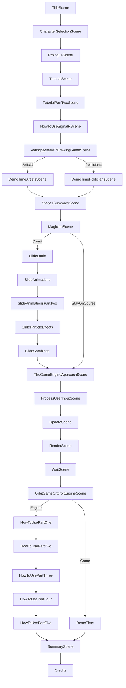


# Title

Welcome the audience, thank you all for joining me today as we embark upon an adventure to learn about building games in .NET MAUI.

# Character selection

While this slightly contradicts the premise of a choose your own adventure book I needed to somehow slip in who I am. Given that the underlying theme of this talk is around building games I thought that a character selection screen made sense.

So who am I?

My name is Shaun Lawrence
I am a software engineer/consultant and have been working with .NET based technologies since my career began roughly 17 years ago.
I am honoured to have been awarded with the Microsoft MVP award for the past 2 years.
I was also 'lucky' enough to be given the opportunity to write a book. My publishing keeps telling me off for not talking about it enough so it is titled 'Introducing .NET MAUI' and is available at all good online book retailers.
In fact I have a copy with me today which I plan to give away at random. More on this shortly...

I guess part of the main reason I am here talking to you all today is because I have learned to fully embrace what I have labelled as weaknesses here.
I do get distracted easily and much like Magpie I like to chase after the next shiny thing.
I am also great at following that shiny thing down a deep deep rabbit hole, get lost or stuck down there and then end up eating some cake to cheer me up.
In fact I now wonder whether I have somehow been rewarding this behaviour... Cake Driven Development

# Prologue

So that is enough about me, let's take a brief look at what we will be covering today and how...

I have been very passionate about gaming ever since saving up to buy my first ever console back in 1992 - the NES. That in combination of a plentiful supply of second hand choose your own adventure books from my nan has helped get me here today.

There are some things that I would like to introduce you all to before we get going on the content.

The first is that all of the content you see today is either baked into a .NET MAUI based game or code within Visual Studio, because I decided to go this route I really struggled to prevent myself from getting carried away with functionality in the hope that the system presenting the content also makes up part of the content itself.

Another point, and while this have been a nice selling point on my talk submission is has proven to be somewhat of a challenge... you will be influencing the content that gets shown today. Through the magic of SignalR you will be able to navigate to a blazor based web page and when each decision point is reached, provide your vote. I should add that I owe a big thanks to a good friend Gerald for having already built some of the SignalR voting system. Thanks to the wonders of open-source I was able to fork it and bend it to suit my needs. One decision point will actually allow you to choose to understand the voting system itself.

And finally, I mentioned before that I would be giving a copy of my book away today. If all goes well and I will be honest this part scares me a little as I saw some inconsistencies in leading up to this part
after voting on the last decision point one lucky voter will be shown a congratulations message. The message does say to come down and collect your prize, it might be best to take a screenshot and then come down
at the end of the talk.

# Tutorial - What is .NET MAUI?

As with all good games this talk wouldn't be complete without first introducing you all to your environment and how it effects us. There are 2 key components affecting us today and the is .NET MAUI.

- Multi-platform App UI

- Cross-platform framework

  - Mobile - Android and iOS

  - Desktop - macOS and Windows

  - Smart Samsung things - Tizen

- Evolution of Xamarin.Forms

  - First class features such as AppBuilder, etc.

- Build with the platform

# Tutorial - What is SignalR?

The second key component is SignalR.

- Open-source

- ASP.NET Core

- Real-time communication

- Bi-directional connection

- Scalable

- Manages complexity for us
    - Fallback via
    - WebSockets
    - Event Source (Server-sent events)
    - Forever Frame (hidden iFrame)
    - Long Polling

- Supports many platforms - JS, C#, F#, VB, Java

# How to use SignalR

# Voting time

This is our first vote so let's hope it works! As I mentioned before you can navigate to a web page, so if you scan this QR code on screen it will open the page for you.

# Voting system demo

# Drawing game demo

# Stage complete

OK so we have covered in some detail what SignalR is and how we can use it within both a server-side and client-side application. And in fact nothing in the client-side really breaks outside of the mould of a typical business application.

I would now like to take you on a bit of a journey to understand how I got to this point, the big bang idea (it's a space game so the pun was definitely intended).

But first I believe we have the option for a minor distraction coming up.

# Magician

Decision time

# Flow

