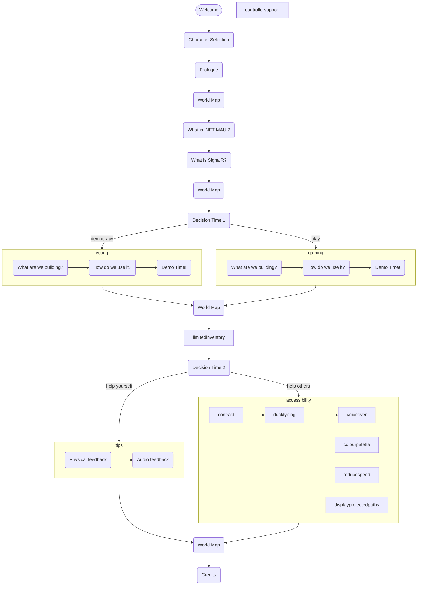

```mermaid
flowchart TD
    welcome([Welcome]) --> cs(Character Selection)
    cs --> prologue(Prologue)
%% trusty steed called MAUI
    prologue --> worldmap0(World Map)
    worldmap0 --> tutorial1(What is .NET MAUI?)
    tutorial1 --> tutorial2(What is SignalR?)
    tutorial2 --> worldmap1(World Map)
    worldmap1 --> decision1(Decision Time 1)

    subgraph voting
        votingtutorial1(What are we building?) --> votingtutorial2(How do we use it?)
        votingtutorial2 --> votingdemo(Demo Time!)
    end

    subgraph gaming
        gamingtutorial1(What are we building?) --> gamingtutorial2(How do we use it?)
        gamingtutorial2 --> gamingdemo(Demo Time!)
    end

%% Explain why we put logic on the server
%% The power of .NET running anywhere

    decision1 --democracy--> voting
    decision1 --play--> gaming

    voting --> worldmap2(World Map)
    gaming --> worldmap2(World Map)

    worldmap2 --> limitedinventory
%%limitedinventory - Explain how we need to play a clever inventory management game - we want to keep our SignalR data packets small. Also consider keeping things like allocations small.
%% travel light
%% "You are overencumbered and cannot run!

    limitedinventory --> decision2(Decision Time 2)

    %% You meet some others on the road heading in your direction, they are clearly struggling to read the signs and discover the safest route, do you agree to let them join your party and help them?

%% speaking of limitations we sadly have a limited amount of time today so this will lead us onto another vote.

    subgraph accessibility
        contrast --> ducktyping
%% something around duck hunt?
        ducktyping --> voiceover

        colourpalette
    
        reducespeed
    
        displayprojectedpaths
    end

    subgraph tips
        physical(Physical feedback) --> audio(Audio feedback)
    end

    decision2 --help others--> accessibility
    decision2 --help yourself--> tips

    tips --> worldmapx

    accessibility --> worldmapx

    worldmapx(World Map) --> credits(Credits)

    controllersupport
```
