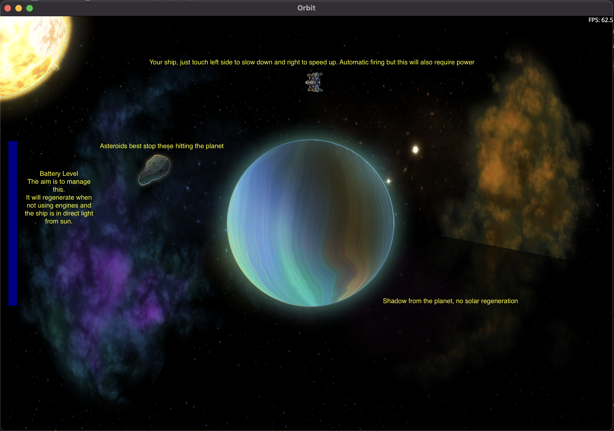

# Orbit

Investigation into building both a game and underlying engine.

## Acknowledgements

The most important part! Inspiration and help has come from:

### Artwork

This is a fantastic piece of open source art:

https://opengameart.org/content/space-game-art-pack-extended

### Trains .NET

David Wengier has been great at not only building this idea already but also open to answering any questions that I have thrown his way.

https://github.com/davidwengier/Trains.NET

### FlappyBird

Matthew Leibowitz created a Flappy Bird clone with SkiaSharp that has helped with plenty of inspiration.

https://github.com/mattleibow/FlappyBird

## Orbit.Engine

This will be aimed at providing a reusable engine to build other 2D games. The initial plan is to build the game Orbit first.

## Orbit Game

The premise of the game is as per this mockup.

With a rough idea of the gameplay here:

