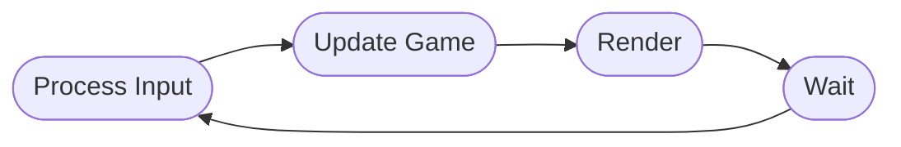

# Orbit Engine

The Orbit engine is a game engine built on top of .NET MAUI Graphics. The objective is to firstly enjoy the journey of building a game engine and secondly providing a framework that allows us to utilise the best parts of a cross-platform framework while building a 'typical' game.

[](https://www.nuget.org/packages/Bijington.Orbit.Engine/)

## The game loop approach

The engine provides a 'typical' game loop approach where it will process input from the user (TBA), call update across the scene and game objects, perform a render cycle for the scene and game objects and then wait until the next loop of the previous is ready.



## Example usage

This section aims at explaining how to use the engine in your project.

### Registering with the `MauiAppBuilder`

The first step is to register the game engine in your `MauiProgram.cs` file using the `UseOrbitEngine` extension method:

```csharp
builder
    .UseMauiApp<App>()
    .UseOrbitEngine()
```

Currently this just registers the `GameSceneManager` provided by the framework as a **singleton**. In the majority of scenarios this should be fine, if you ever need multiple instances (perhaps you want 2 scenes running side-by-side in a couch based co-op mode) then you will likely need to register this as `AddTransient` manually yourself and don't call `UseOrbitEngine`.

### Creating your first `GameScene`

A `GameScene` represents a screen in your game and its associated state. This is typically your home screen, actual game screen or even individual levels.

```csharp
public class MainScene : GameScene
{
    public MainScene()
    {
        // Call Add(..) to add GameObjects to your scene.
    }

    public override void Render(ICanvas canvas, RectF dimensions)
    {
        base.Render(canvas, dimensions);

        // Render the state of your scene.
    }

    public override void Update(double millisecondsSinceLastUpdate)
    {
        base.Update(millisecondsSinceLastUpdate);

        // Update the state of your scene.
    }
}
```

### Creating your first `GameObject`

A `GameObject` represents a single object in your game. It is recommended that you keep this as simple as possible.

```csharp
public class Paddle : GameObject
{
    public override void Render(ICanvas canvas, RectF dimensions)
    {
        base.Render(canvas, dimensions);
    
        // Render the state of your object.
    }

    public override void Update(double millisecondsSinceLastUpdate)
    {
        base.Update(millisecondsSinceLastUpdate);

        // Update the state of your scene.
    }
}
```

### Rendering your `GameScene`

The `GameSceneView` provides the surface on which your game will be rendered. The `IGameSceneManager` implementation allows you to load scenes into the `GameSceneView` and also then control the state of the scene (e.g. Pause, Stop, Start).

#### XAML

To render the `GameSceneView` in XAML first add the namespace:

```xaml
xmlns:engine="clr-namespace:Orbit.Engine;assembly=Orbit.Engine"
```

Then add the view itself as part of the content of your page:

```xaml
<engine:GameSceneView x:Name="GameView" />
```

**NOTE:** the GameSceneView inherits from [Microsoft.Maui.Graphics.GraphicsView](https://docs.microsoft.com/dotnet/maui/user-interface/graphics/) which gives a fair amount of touch based interaction should you need to. *Orbit will eventually provide an encapsulated way of tracking user based touch/click interaction.*

#### C#

It is also possible to build your page with just C#. First add the following using:

```csharp
using Orbit.Engine;
```

Then add the view itself as part of the content of your page:

```csharp
public MyPage()
{
    Content = new GameSceneView();
}
```

### Loading a scene

Once you have added your `GameSceneView` you need to use the `IGameSceneManager` implementation to call `LoadScene`.

```csharp
public MyPage(IGameSceneManager gameSceneManager)
{
    gameSceneManager.LoadScene<MainScene>(GameView);
}
```

This will leave the scene in the `Loaded` state, in order to actually start the game you will need to call `gameSceneManager.Start()`.

> **Note**
> The lifetime of dependencies are scoped per call to `LoadScene` therefore if you register implementations as `AddScoped` with the `MauiAppBuilder` then you will get a new instance each time `LoadScene` is called. This works particularly well when you need a single instance for the life of a scene.